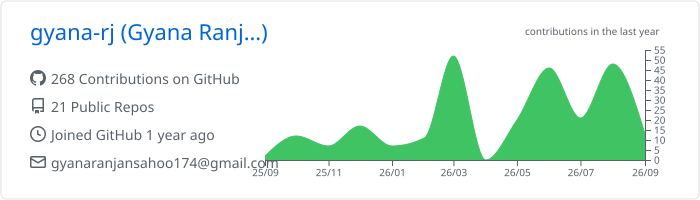
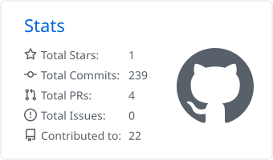
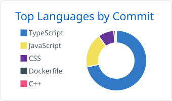

<h1 align="center">Hi, I'm Gyana Ranjan Sahoo 👋</h1>

  Final-year Computer Engineering student · Full-stack & Mobile · DevOps · Bhubaneswar, India

  
  
  
  
  

---

### About Me

- 🎓 B.Tech in Computer Engineering at Siksha 'O' Anusandhan (ITER), graduating July 2027
- 🛠️ I build full-stack web and cross-platform mobile apps in TypeScript: AI app generation, real-time collaboration over WebSockets, and Expo apps for iOS, Android and web
- 🚢 I ship them too, with Turborepo monorepos, Docker, GitHub Actions CI/CD, and deploys on AWS, Vercel and Render
- 🧠 Strong DSA foundation in C++, with a 500+ day LeetCode streak
- 📚 Completed the 100xDevs Full Stack cohort
- 🎯 Open to **SDE internships** and **new-grad roles (2027)**

---

### Featured Projects

| Project | What it does | Stack |
|---|---|---|
| [**App Forge**](https://github.com/gyana-rj/bolt-mobile-app) · [live](https://bolt-mobile-app-frontend.vercel.app) | AI app builder that turns a plain-English prompt into a working React Native (Expo) app, streaming generated code into a live in-browser WebContainer preview, with an Expo tunnel for instant on-device previews. Four-service monorepo with an AWS EC2 Auto Scaling orchestrator | Next.js, Express, Bun, Gemini, Prisma, PostgreSQL, AWS, Docker, Turborepo |
| [**Sonexa**](https://github.com/gyana-rj/Sonexa) | Social music streaming platform with instant track search, YouTube/Spotify playback, and real-time listening rooms with synchronized playback, presence and community upvoting on the shared queue | Next.js 16, NextAuth, Prisma, PostgreSQL, Docker, Turborepo |
| [**CNVS**](https://github.com/gyana-rj/collaborative-whiteboard) · [live](https://www.collaborativewhiteboard.tech/) | Real-time collaborative whiteboard on the raw HTML5 Canvas API: rooms, freehand, shapes, arrows and text, synced over a custom WebSocket protocol with sub-50ms latency and persisted drawings | Next.js, Canvas API, Express, `ws`, Prisma, PostgreSQL, JWT |
| [**Freshly**](https://github.com/gyana-rj/freshly-expo) | Cross-platform grocery list and meal planner (iOS, Android, web) with spending and category insights. Typed Expo Router API routes, EAS builds and OTA updates, Sentry in production | Expo, React Native, NativeWind, Zustand, Clerk, Drizzle, Neon Postgres |
| [**Auralis**](https://github.com/gyana-rj/Auralis) | Discord music bot that plays YouTube and Spotify links or search terms in voice channels, with a queue and slash-command controls. Dockerized with CI | discord.js v14, DisTube, TypeScript, Docker |

---

### Tech Stack

**Languages** 

**Frontend & Mobile** 

**Backend** 

**Databases & ORM** 

**DevOps & Cloud** 

**Monitoring & Observability** 

---

### GitHub Stats

<!-- Generated daily by .github/workflows/profile-cards.yml -->

  <picture>
    <source media="(prefers-color-scheme: dark)" srcset="./profile-summary-card-output/github_dark/0-profile-details.svg">
    
  </picture>

  <picture>
    <source media="(prefers-color-scheme: dark)" srcset="./profile-summary-card-output/github_dark/3-stats.svg">
    
  </picture>
  <picture>
    <source media="(prefers-color-scheme: dark)" srcset="./profile-summary-card-output/github_dark/2-most-commit-language.svg">
    
  </picture>

---

  📫 Reach me on <a href="https://www.linkedin.com/in/ranjangyana/">LinkedIn</a>, by <a href="mailto:gyanaranjansahoo174@gmail.com">email</a>, or through <a href="https://devgyana.in">devgyana.in</a>

